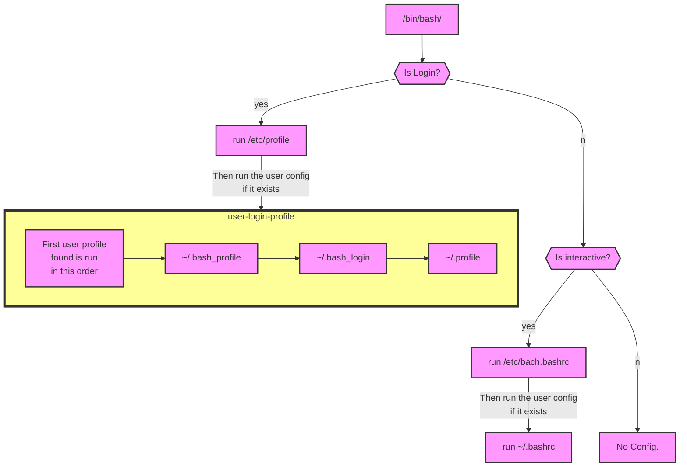
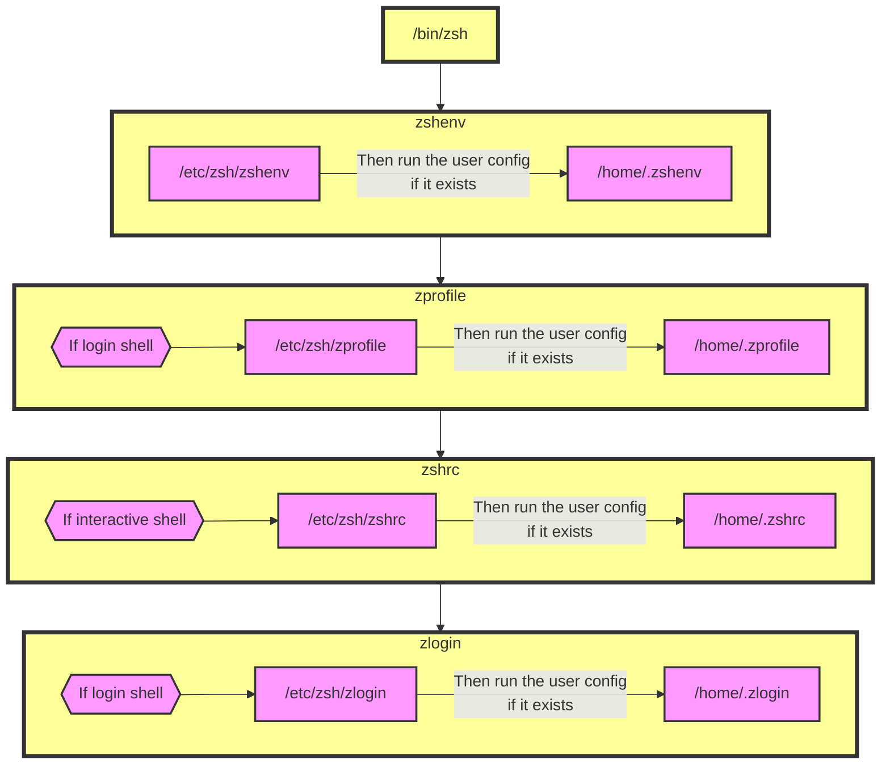

# Shells

## Different shells.

Shells come in various flavours, zsh, bash, sh, fish, etc, etc. 

A command shell is simply a text based command-line interface to interact with and manipulate a computer's operating system.

To see what shell we are currently in we can often just echo the SHELL variable which is normally set.
```bash
echo $SHELL
```
This doesn't work for all shells so better to do
```bash
ps -p $$
```

There is a special file on linux/mac that lists the currently available shells we can launch.
```bash
cat /etc/shells
```

### Quick aside on `ps`
Linux is a multitasking and multi-user system. So, it allows multiple processes to operate simultaneously without interfering with each other.
Linux provides us a utility called `ps` for viewing information related with the processes on a system which stands as abbreviation for “Process Status”.
The `-p` option allows us to see a specific process based on an id. the `$$` is a special variable  which gives the process ID (PID) of the current running process.

## Shell users.

The linux and os systems allow multiple different users! On Linux we can see all the users in a special file 
```bash
cat /etc/passwd
```

On mac the users are no longer managed this way. The /etc/passwd file is only consulted when the OS is in single-user mode. The "standard" location for account information on OS X is the DirectoryService. We can list users with: 
```bash
dscl . list /Users
```

To see the current user:
```bash
echo "$USER"
```

Or even more obvious with the 
```bash
whoami
```

## Login vs non-login.

A login shell is a shell given to a user upon login into their user account. This is initiated by using the `-l` or `--login` option when calling the shell. When you open the terminal this is likely what is happening.

In contrast sub shells, also called non-login shells are started after the login process without the `-l` or `--login` option.

To simulate a login for user "username" one can do `sudo -iu username`, this runs the shell specified for the user in `/etc/passwd` on linux or in the DirectoryService on OSX. Similarly one can run the same command without the `-i` login option to run the shell without login.


### Profiles
> .zshrc/.profile/.bashrc/...

Config flows:

The startup scripts run depend on the shell, whether the shell is running interactively and whether it is a login shell.

## bash config flow



## zsh config flow


